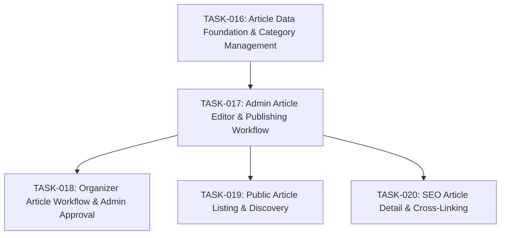

# SPEC-003: Task Map

- Spec: [SPEC-003-news-blog-seo.md](../specs/SPEC-003-news-blog-seo.md)

## Dependency Graph

## Task List

- [x] `TASK-016`: [Article Data Foundation & Category Management](TASK-016-article-data-and-categories.md)
- [x] `TASK-017`: [Admin Article Editor & Publishing Workflow](TASK-017-admin-article-editor.md)
- [x] `TASK-018`: [Organizer Article Workflow & Admin Approval](TASK-018-organizer-article-workflow.md)
- [x] `TASK-019`: [Public Article Listing & Discovery](TASK-019-public-article-listing.md)
- [x] `TASK-020`: [SEO Article Detail & Cross-Linking](TASK-020-seo-article-detail.md)
