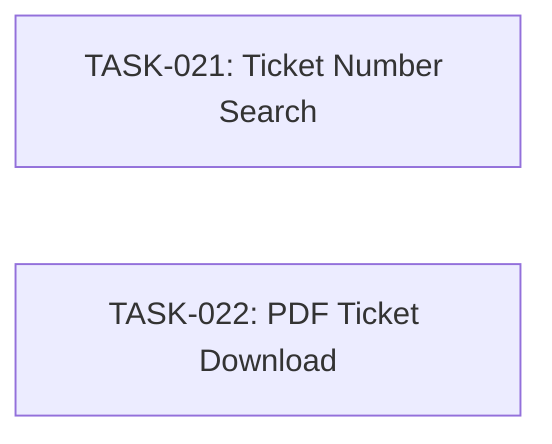

# SPEC-004: Task Map

- Spec: [SPEC-004-ticket-lookup-download.md](../specs/SPEC-004-ticket-lookup-download.md)

## Dependency Graph

Both tasks are independent and can run in parallel.

## Task List

- [x] `TASK-021`: [Ticket Number Search](TASK-021-ticket-number-search.md)
- [x] `TASK-022`: [PDF Ticket Download](TASK-022-pdf-ticket-download.md)

## Acceptance Coverage

| AC | Task |
| --- | --- |
| AC-01 | TASK-021 |
| AC-02 | TASK-021 |
| AC-03 | TASK-021 |
| AC-04 | TASK-022 |
| AC-05 | TASK-022 |
| AC-06 | TASK-022 |
| AC-07 | TASK-022 |
| AC-08 | TASK-021 |
| AC-09 | TASK-021 |
| AC-10 | TASK-022 |
| AC-11 | TASK-022 |
| AC-12 | TASK-022 |
