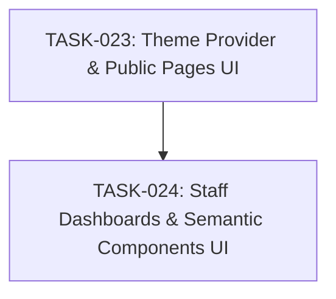

# SPEC-005: Task Map

- Spec: [SPEC-005-dark-light-mode.md](../specs/SPEC-005-dark-light-mode.md)

## Dependency Graph

## Task List

- [x] `TASK-023`: [Theme Provider & Public Pages UI](TASK-023-theme-provider-public-ui.md)
- [x] `TASK-024`: [Staff Dashboards & Semantic Components UI](TASK-024-staff-dashboards-light-mode.md)

## Acceptance Coverage

| AC | Task |
| --- | --- |
| AC-01 | TASK-023 |
| AC-02 | TASK-023 |
| AC-03 | TASK-023, TASK-024 |
| AC-04 | TASK-023 |
| AC-05 | TASK-024 |
| AC-06 | TASK-024 |
