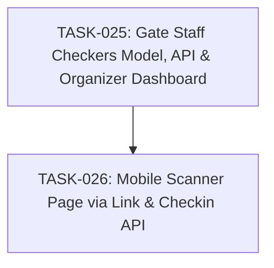

# SPEC-006: Task Map

- Spec: [SPEC-006-gate-staff-checkers.md](../specs/SPEC-006-gate-staff-checkers.md)

## Dependency Graph

## Task List

- [x] `TASK-025`: [Gate Staff Checkers Model, API & Organizer Dashboard](TASK-025-gate-staff-management.md)
- [x] `TASK-026`: [Mobile Scanner Page via Link & Checkin API](TASK-026-mobile-scanner-link.md)

## Acceptance Coverage

| AC | Task |
| --- | --- |
| AC-01 | TASK-025 |
| AC-02 | TASK-025 |
| AC-03 | TASK-025 |
| AC-04 | TASK-026 |
| AC-05 | TASK-026 |
| AC-06 | TASK-026 |
| AC-07 | TASK-025 |
| AC-08 | TASK-025 |
| AC-09 | TASK-025, TASK-026 |
