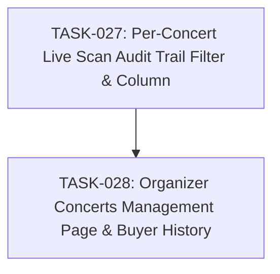

# SPEC-007: Task Map

- Spec: [SPEC-007-organizer-events-and-audit.md](../specs/SPEC-007-organizer-events-and-audit.md)

## Dependency Graph

## Task List

- [x] `TASK-027`: [Per-Concert Live Scan Audit Trail Filter & Column](TASK-027-per-concert-scan-audit.md)
- [x] `TASK-028`: [Organizer Concerts Management Page & Buyer History](TASK-028-organizer-events-management.md)

## Acceptance Coverage

| AC | Task |
| --- | --- |
| AC-01 | TASK-027 |
| AC-02 | TASK-027 |
| AC-03 | TASK-028 |
| AC-04 | TASK-028 |
| AC-05 | TASK-028 |
| AC-06 | TASK-028 |
| AC-07 | TASK-028 |
| AC-08 | TASK-027, TASK-028 |
