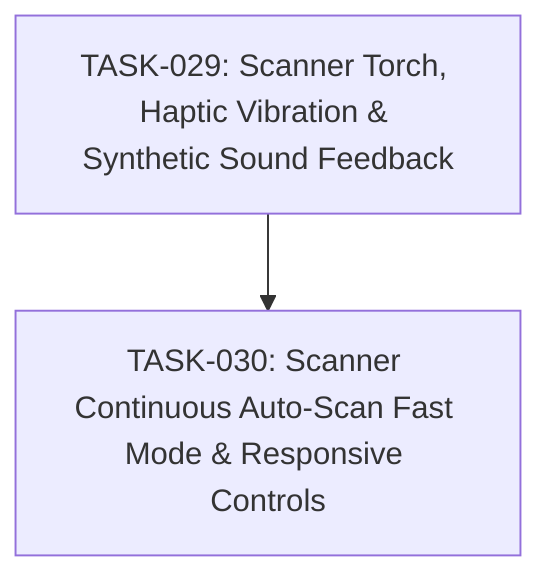

# SPEC-008: Task Map

- Spec: [SPEC-008-scanner-torch-haptic-continuous.md](../specs/SPEC-008-scanner-torch-haptic-continuous.md)

## Dependency Graph

## Task List

- [x] `TASK-029`: [Scanner Torch, Haptic Vibration & Synthetic Sound Feedback](TASK-029-scanner-torch-haptic-feedback.md)
- [x] `TASK-030`: [Scanner Continuous Auto-Scan Fast Mode & Responsive Controls](TASK-030-scanner-continuous-fast-mode.md)

## Acceptance Coverage

| AC | Task |
| --- | --- |
| AC-01 | TASK-029 |
| AC-02 | TASK-029 |
| AC-03 | TASK-029 |
| AC-04 | TASK-029 |
| AC-05 | TASK-029 |
| AC-06 | TASK-030 |
| AC-07 | TASK-030 |
| AC-08 | TASK-030 |
| AC-09 | TASK-029, TASK-030 |
