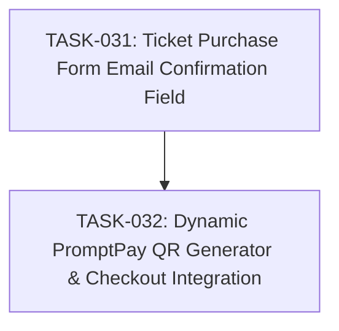

# SPEC-009: Task Map

- Spec: [SPEC-009-promptpay-qr-and-confirm-email.md](../specs/SPEC-009-promptpay-qr-and-confirm-email.md)

## Dependency Graph

## Task List

- [x] `TASK-031`: [Ticket Purchase Form Email Confirmation Field](TASK-031-checkout-confirm-email.md)
- [x] `TASK-032`: [Dynamic PromptPay QR Generator & Checkout Integration](TASK-032-promptpay-dynamic-qr.md)

## Acceptance Coverage

| AC | Task |
| --- | --- |
| AC-01 | TASK-031 |
| AC-02 | TASK-031 |
| AC-03 | TASK-032 |
| AC-04 | TASK-032 |
| AC-05 | TASK-032 |
| AC-06 | TASK-032 |
| AC-07 | TASK-031, TASK-032 |
