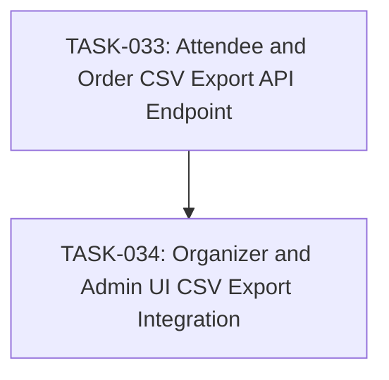

# SPEC-010: Task Map

- Spec: [SPEC-010-attendee-csv-export.md](../specs/SPEC-010-attendee-csv-export.md)

## Dependency Graph

## Task List

- [x] `TASK-033`: [Attendee and Order CSV Export API Endpoint](TASK-033-attendee-order-export-api.md)
- [x] `TASK-034`: [Organizer and Admin UI CSV Export Integration](TASK-034-attendee-export-organizer-admin-ui.md)

## Acceptance Coverage

| AC | Task |
| --- | --- |
| AC-01 | TASK-033 |
| AC-02 | TASK-033 |
| AC-03 | TASK-033 |
| AC-04 | TASK-033 |
| AC-05 | TASK-034 |
| AC-06 | TASK-034 |
