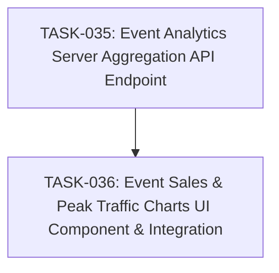

# SPEC-011: Task Map

- Spec: [SPEC-011-event-analytics-and-peak-charts.md](../specs/SPEC-011-event-analytics-and-peak-charts.md)

## Dependency Graph

## Task List

- [x] `TASK-035`: [Event Analytics Server Aggregation API Endpoint](TASK-035-event-analytics-aggregation-api.md)
- [x] `TASK-036`: [Event Sales & Peak Traffic Charts UI Component & Integration](TASK-036-event-analytics-charts-ui.md)

## Acceptance Coverage

| AC | Task |
| --- | --- |
| AC-01 | TASK-035 |
| AC-02 | TASK-035 |
| AC-03 | TASK-036 |
| AC-04 | TASK-036 |
| AC-05 | TASK-036 |
| AC-06 | TASK-036 |
