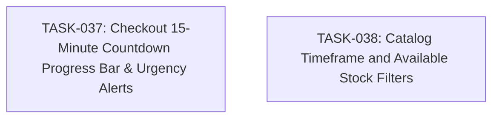

# SPEC-012: Task Map

- Spec: [SPEC-012-checkout-timer-and-catalog-filters.md](../specs/SPEC-012-checkout-timer-and-catalog-filters.md)

## Dependency Graph

## Task List

- [x] `TASK-037`: [Checkout 15-Minute Countdown Progress Bar & Urgency Alerts](TASK-037-checkout-countdown-progress-timer.md)
- [x] `TASK-038`: [Catalog Timeframe and Available Stock Filters](TASK-038-catalog-timeframe-and-stock-filters.md)

## Acceptance Coverage

| AC | Task |
| --- | --- |
| AC-01 | TASK-037 |
| AC-02 | TASK-037 |
| AC-03 | TASK-037 |
| AC-04 | TASK-038 |
| AC-05 | TASK-038 |
| AC-06 | TASK-037, TASK-038 |
