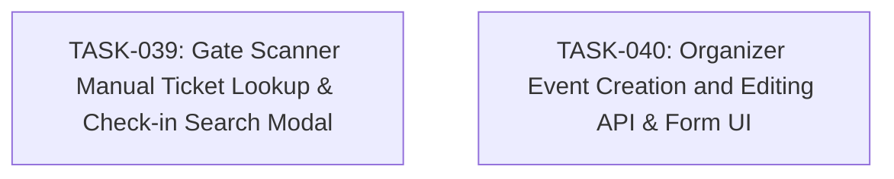

# SPEC-013: Task Map

- Spec: [SPEC-013-scanner-manual-search-and-organizer-event-crud.md](../specs/SPEC-013-scanner-manual-search-and-organizer-event-crud.md)

## Dependency Graph

## Task List

- [x] `TASK-039`: [Gate Scanner Manual Ticket Lookup & Check-in Search Modal](TASK-039-scanner-manual-ticket-lookup.md)
- [x] `TASK-040`: [Organizer Event Creation and Editing API & Form UI](TASK-040-organizer-event-creation-and-edit.md)

## Acceptance Coverage

| AC | Task |
| --- | --- |
| AC-01 | TASK-039 |
| AC-02 | TASK-039 |
| AC-03 | TASK-040 |
| AC-04 | TASK-040 |
| AC-05 | TASK-040 |
| AC-06 | TASK-039, TASK-040 |
