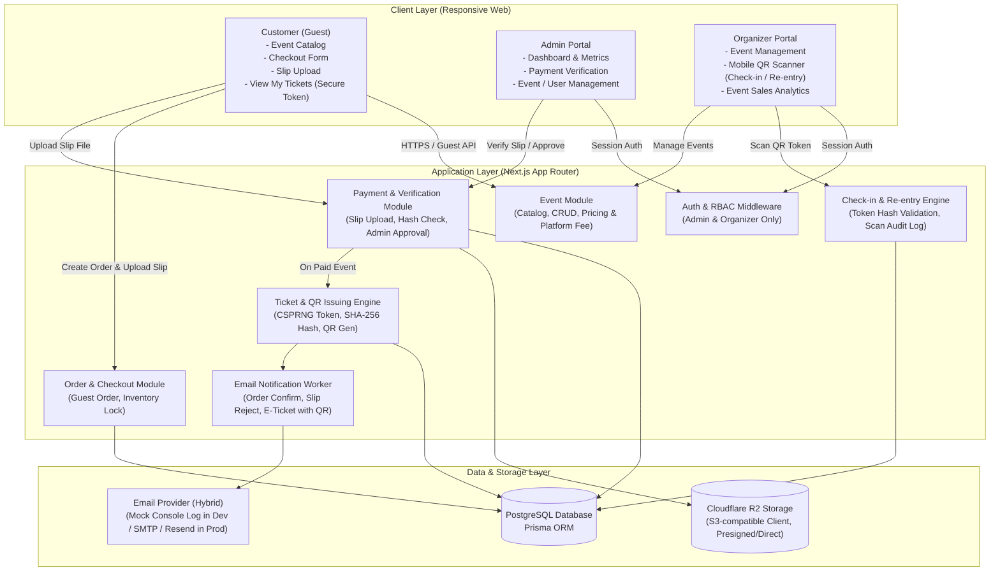
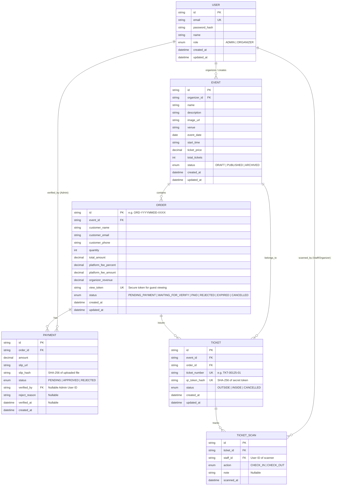
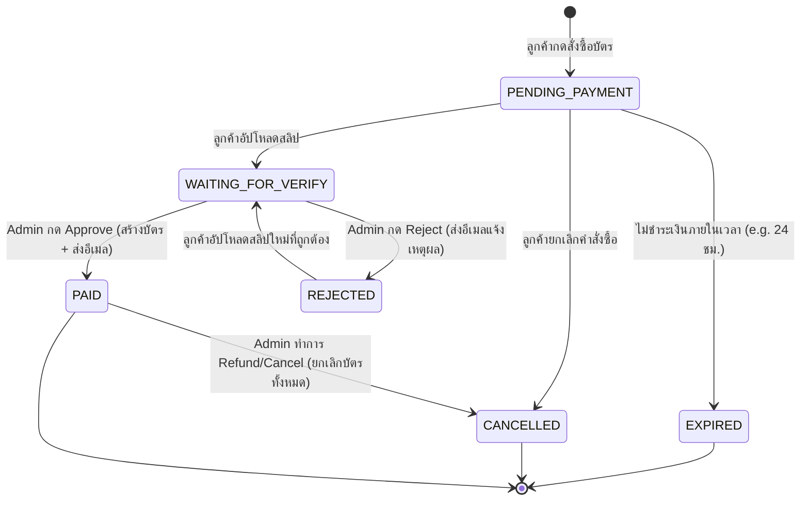
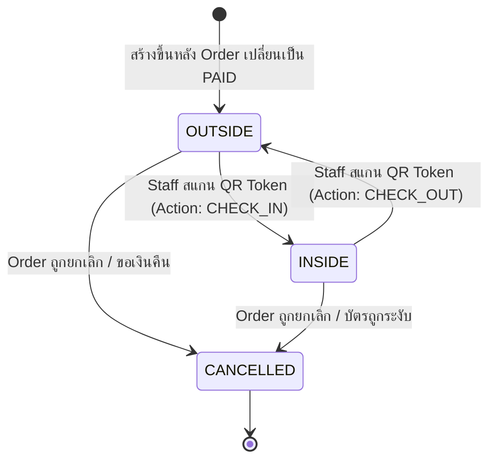
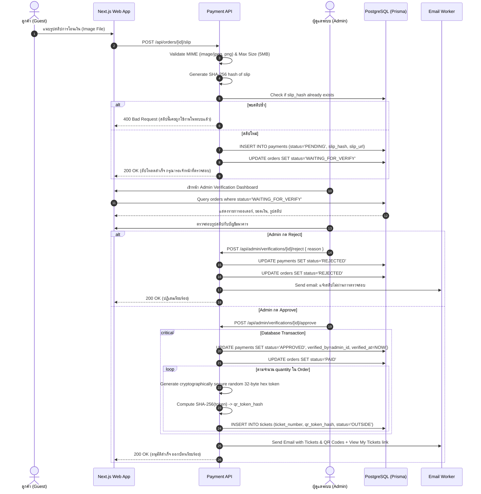
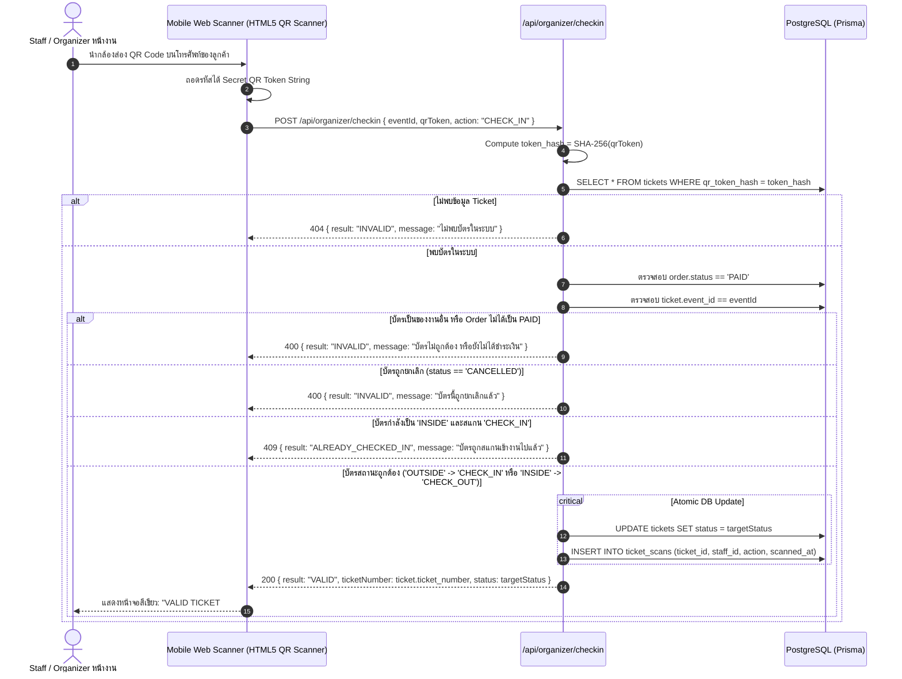

# Technical Specification: MVP Event Ticketing Platform

> **Status:** Draft / Proposed for MVP  
> **Scope:** Web Application สำหรับขายบัตรคอนเสิร์ต/อีเวนต์ขนาดเล็ก รองรับ Bank Transfer + Slip Verification + QR Check-in + Re-entry  
> **Stack:** Next.js (App Router, TypeScript), Tailwind CSS, PostgreSQL, Prisma ORM, Cloudflare R2 (S3-compatible)  
> **Design Theme:** Modern High-Contrast Monochromatic (ขาว-ดำ / Clean Black & White Concert Aesthetic)  

---

## 1. System Architecture

### 1.1 Overview & Architecture Diagram

ระบบถูกออกแบบในรูปแบบ **Modular Monolith** บน Next.js App Router เพื่อความเรียบง่ายในการพัฒนาและ deploy สำหรับ MVP โดยแยก Domain Logic ระหว่าง Payment, Ticket Generation และ Check-in ไว้อย่างชัดเจน เพื่อให้ในอนาคตสามารถเสียบ Payment Gateway (เช่น PromptPay QR Bot, Stripe, Omise) เข้ามาแทนระบบ Manual Slip Verification ได้ทันทีโดยไม่ต้องแก้ระบบ Ticket และ Check-in



### 1.2 Architectural Highlights for Small MVP
1. **Single Deployable Unit**: Next.js App Router รวม Frontend + API Route / Server Actions ไว้อยู่ในระบบเดียว ไม่ต้องแยก microservices
2. **No Customer Account Friction**: ลูกค้าทั่วไปสั่งซื้อในฐานะ Guest (กรอกชื่อ, อีเมล, เบอร์โทร) เข้าดูบัตรผ่าน Secure View Token จากอีเมล ลดความซับซ้อนของระบบลงทะเบียน/ลืมรหัสผ่าน
3. **Decoupled Payment Boundary**: Payment Module สื่อสารกับ Ticket Engine ผ่าน State Transition `WAITING_FOR_VERIFY -> PAID` เมื่อมี Payment Gateway อัตโนมัติในอนาคต เพียงแค่ให้ Webhook ยิงมาเปลี่ยนสถานะเป็น `PAID` ระบบ Ticket ก็จะทำงานต่อได้โดยไม่ต้องแก้ไขอะไร

---

## 2. ERD (Entity Relationship Diagram)



---

## 3. Database Schema (Prisma Schema)

```prisma
datasource db {
  provider = "postgresql"
  url      = env("DATABASE_URL")
}

generator client {
  provider = "prisma-client-js"
}

enum Role {
  ADMIN
  ORGANIZER
}

enum EventStatus {
  DRAFT
  PUBLISHED
  ARCHIVED
}

enum OrderStatus {
  PENDING_PAYMENT
  WAITING_FOR_VERIFY
  PAID
  REJECTED
  EXPIRED
  CANCELLED
}

enum PaymentStatus {
  PENDING
  APPROVED
  REJECTED
}

enum TicketStatus {
  OUTSIDE
  INSIDE
  CANCELLED
}

enum ScanAction {
  CHECK_IN
  CHECK_OUT
}

model User {
  id            String       @id @default(cuid())
  email         String       @unique
  passwordHash  String       @map("password_hash")
  name          String
  role          Role         @default(ORGANIZER)
  createdAt     DateTime     @default(now()) @map("created_at")
  updatedAt     DateTime     @updatedAt @map("updated_at")

  events        Event[]      @relation("OrganizerEvents")
  verifiedSlips Payment[]    @relation("AdminVerifiedPayments")
  scans         TicketScan[] @relation("StaffScans")

  @@map("users")
}

model Event {
  id           String      @id @default(cuid())
  organizerId  String      @map("organizer_id")
  name         String
  description  String      @db.Text
  imageUrl     String      @map("image_url")
  venue        String
  eventDate    DateTime    @map("event_date") @db.Date
  startTime    String      @map("start_time") // e.g. "18:00"
  ticketPrice  Decimal     @map("ticket_price") @db.Decimal(10, 2)
  totalTickets Int         @map("total_tickets")
  status       EventStatus @default(DRAFT)
  createdAt    DateTime    @default(now()) @map("created_at")
  updatedAt    DateTime    @updatedAt @map("updated_at")

  organizer    User        @relation("OrganizerEvents", fields: [organizerId], references: [id])
  orders       Order[]
  tickets      Ticket[]

  @@index([status, eventDate])
  @@map("events")
}

model Order {
  id                 String      @id @default(cuid()) // Formatted as ORD-XXXXX
  eventId            String      @map("event_id")
  customerName       String      @map("customer_name")
  customerEmail      String      @map("customer_email")
  customerPhone      String      @map("customer_phone")
  quantity           Int
  totalAmount        Decimal     @map("total_amount") @db.Decimal(10, 2)
  platformFeePercent Decimal     @default(5.00) @map("platform_fee_percent") @db.Decimal(5, 2)
  platformFeeAmount  Decimal     @map("platform_fee_amount") @db.Decimal(10, 2)
  organizerRevenue   Decimal     @map("organizer_revenue") @db.Decimal(10, 2)
  viewToken          String      @unique @map("view_token") // Secure random 32-char hex for guest ticket access
  status             OrderStatus @default(PENDING_PAYMENT)
  expiresAt          DateTime    @map("expires_at") // 15-minute reservation countdown
  createdAt          DateTime    @default(now()) @map("created_at")
  updatedAt          DateTime    @updatedAt @map("updated_at")

  event              Event       @relation(fields: [eventId], references: [id])
  payments           Payment[]
  tickets            Ticket[]

  @@index([customerEmail])
  @@index([status])
  @@map("orders")
}

model Payment {
  id           String        @id @default(cuid())
  orderId      String        @map("order_id")
  amount       Decimal       @db.Decimal(10, 2)
  slipUrl      String        @map("slip_url")
  slipHash     String        @map("slip_hash") // SHA-256 of uploaded file to prevent duplicate slips
  status       PaymentStatus @default(PENDING)
  verifiedById String?       @map("verified_by")
  rejectReason String?       @map("reject_reason") @db.Text
  verifiedAt   DateTime?     @map("verified_at")
  createdAt    DateTime      @default(now()) @map("created_at")

  order        Order         @relation(fields: [orderId], references: [id], onDelete: Cascade)
  verifier     User?         @relation("AdminVerifiedPayments", fields: [verifiedById], references: [id])

  @@index([slipHash])
  @@map("payments")
}

model Ticket {
  id           String       @id @default(cuid())
  eventId      String       @map("event_id")
  orderId      String       @map("order_id")
  ticketNumber String       @unique @map("ticket_number") // Formatted readable TKT-XXXXX-01
  qrTokenHash  String       @unique @map("qr_token_hash") // SHA-256 of random 32-byte cryptographically secure token
  status       TicketStatus @default(OUTSIDE)
  createdAt    DateTime     @default(now()) @map("created_at")
  updatedAt    DateTime     @updatedAt @map("updated_at")

  event        Event        @relation(fields: [eventId], references: [id])
  order        Order        @relation(fields: [orderId], references: [id], onDelete: Cascade)
  scans        TicketScan[]

  @@index([eventId, status])
  @@map("tickets")
}

model TicketScan {
  id        String     @id @default(cuid())
  ticketId  String     @map("ticket_id")
  staffId   String     @map("staff_id")
  action    ScanAction
  note      String?
  scannedAt DateTime   @default(now()) @map("scanned_at")

  ticket    Ticket     @relation(fields: [ticketId], references: [id], onDelete: Cascade)
  staff     User       @relation("StaffScans", fields: [staffId], references: [id])

  @@index([ticketId, scannedAt])
  @@map("ticket_scans")
}
```

---

## 4. API Routes / Server Actions Specification

| Area | Method & Endpoint / Action | Auth / Role | Input Payload | Output / Response | Description |
|---|---|---|---|---|---|
| **Public Catalog** | `GET /api/events` | Public | Query: `page`, `limit` | `{ events: [...] }` | แสดง Event ที่มีสถานะ `PUBLISHED` สำหรับหน้าแรก |
| **Public Catalog** | `GET /api/events/[id]` | Public | Param: `id` | `{ event: {...} }` | ดึงรายละเอียด Event สำหรับหน้าดูข้อมูลและจองบัตร |
| **Checkout** | `POST /api/orders` | Public (Guest) | `{ eventId, customerName, customerEmail, customerPhone, quantity }` | `{ orderId, totalAmount, bankAccount, expiresAt, uploadUrl }` | สร้าง Order สถานะ `PENDING_PAYMENT` พร้อมคำนวณยอดเงินและ Platform Fee |
| **Checkout** | `POST /api/orders/[id]/slip` | Public (Guest) | `multipart/form-data`: `file` (image/jpeg, png, max 5MB) | `{ success: true, orderStatus: "WAITING_FOR_VERIFY" }` | อัปโหลดสลิป, ตรวจสอบ `slip_hash` ป้องกันส่งสลิปซ้ำ, เปลี่ยน Order เป็น `WAITING_FOR_VERIFY` |
| **Guest Tickets** | `GET /api/tickets/view?token=[token]` | Public (Token Auth) | Query: `token` (Order `view_token`) | `{ order: {...}, tickets: [{ ticketNumber, qrDataUrl, status }] }` | หน้า "View My Tickets" สำหรับลูกค้าดูบัตรและ QR Code โดยไม่ต้องมี User Login |
| **Auth** | `POST /api/auth/login` | Public | `{ email, password }` | `{ user: { id, email, role, name } }` + Set HTTP-Only Cookie | เข้าสู่ระบบสำหรับ Admin หรือ Organizer |
| **Auth** | `POST /api/auth/logout` | Authenticated | None | `{ success: true }` + Clear Cookie | ออกจากระบบ |
| **Auth** | `GET /api/auth/me` | Authenticated | None | `{ user: {...} }` | ตรวจสอบ Session ผู้ใช้งานปัจจุบัน |
| **Admin** | `GET /api/admin/metrics` | Admin | None | `{ totalEvents, totalOrders, totalRevenue, pendingVerification, totalTickets, totalCheckins }` | ดึงตัวเลขสรุปภาพรวมสำหรับ Admin Dashboard |
| **Admin** | `GET /api/admin/verifications` | Admin | Query: `status`, `page` | `{ orders: [{ id, customer, amount, slipUrl, createdAt }] }` | รายการสลิปที่รอการตรวจสอบ (`WAITING_FOR_VERIFY`) |
| **Admin** | `POST /api/admin/verifications/[id]/approve` | Admin | None | `{ success: true, orderStatus: "PAID", ticketsCreated: N }` | อนุมัติสลิป -> เปลี่ยนสถานะเป็น `PAID` -> สร้าง Tickets -> ส่งอีเมลบัตร |
| **Admin** | `POST /api/admin/verifications/[id]/reject` | Admin | `{ reason: string }` | `{ success: true, orderStatus: "REJECTED" }` | ปฏิเสธสลิป -> เปลี่ยนสถานะเป็น `REJECTED` -> ส่งอีเมลแจ้งลูกค้า |
| **Organizer** | `GET /api/organizer/events` | Organizer | None | `{ events: [...] }` | แสดงเฉพาะ Event ของ Organizer คนนั้น |
| **Organizer** | `POST /api/organizer/events` | Organizer | `{ name, description, venue, eventDate, startTime, ticketPrice, totalTickets, imageUrl }` | `{ event: {...} }` | สร้าง Event ใหม่ (สถานะเริ่มต้นเป็น `DRAFT`) |
| **Organizer** | `PATCH /api/organizer/events/[id]/publish` | Organizer | Param: `id` | `{ event: { status: "PUBLISHED" } }` | เผยแพร่งานเพื่อให้ลูกค้าเริ่มซื้อบัตรได้ |
| **Organizer** | `GET /api/organizer/events/[id]/stats` | Organizer | Param: `id` | `{ ticketsSold, ticketsRemaining, revenue, checkedIn, notCheckedIn }` | สถิติบัตรและยอดขายเฉพาะงานนั้น |
| **Organizer** | `POST /api/organizer/checkin` | Organizer | `{ eventId, qrToken, action: "CHECK_IN" \| "CHECK_OUT" }` | `{ result: "VALID" \| "ALREADY_CHECKED_IN" \| "INVALID", ticket: {...} }` | สแกน QR Token สำหรับ Check-in หรือ Check-out (Re-entry) พร้อมบันทึก Log |

---

## 5. Authentication & Authorization Strategy

### 5.1 No Customer Authentication (Zero Friction)
- ลูกค้า **ไม่มี Password / บัญชีผู้ใช้**
- เข้าถึงคำสั่งซื้อและบัตรด้วย **Secret URL Token (`view_token`)** ซึ่งเป็น UUID/CSPRNG 32 ตัวอักษรที่มีความ entropy สูง ส่งให้เฉพาะใน Email ของผู้ซื้อ

### 5.2 Admin & Organizer Authentication
- ใช้ **HTTP-Only, Secure, SameSite Cookie** เก็บ JWT Session หรือ Iron Session
- Password Hashing ใช้ **Argon2id** หรือ **bcrypt (cost factor 12)**
- Role-Based Access Control (RBAC):
  1. `ADMIN`: เข้าถึงทุก Route ภายใต้ `/api/admin/*`, ดูแลระบบทั้งหมด, อนุมัติ/ปฏิเสธ Payment, ดูการเงินรวมของ Platform
  2. `ORGANIZER`: เข้าถึง Route ภายใต้ `/api/organizer/*`, จัดการเฉพาะ Event ของตนเอง (`event.organizer_id == session.userId`), ใช้งานหน้าสแกนบัตรหน้างาน

### 5.3 Event Scoping Guard
- ในหน้า Check-in ระบบจะบังคับให้ Organizer เลือก Event ปัจจุบันก่อนสแกน
- API Check-in จะตรวจสอบเสมอว่า Ticket ที่สแกนมี `ticket.event_id == current_event_id` ป้องกันการเอาบัตรของงานอื่นมาใช้

---

## 6. Order State Machine



### Transition Invariants Table
| สถานะปัจจุบัน | สถานะปลายทาง | ผู้มีสิทธิ์ Trigger | Event / เงื่อนไข | Side Effects ที่ต้องเกิดขึ้น |
|---|---|---|---|---|
| `None` | `PENDING_PAYMENT` | Guest Customer | ลูกค้ากดยืนยันคำสั่งซื้อ | ตรวจสอบจำนวนบัตรที่เหลือ, ล็อกจำนวนบัตร, สร้าง `Order` พร้อม `view_token` |
| `PENDING_PAYMENT` | `WAITING_FOR_VERIFY` | Guest Customer | ลูกค้าอัปโหลดรูปสลิป | คำนวณ `slip_hash`, ตรวจสอบสลิปซ้ำ, บันทึก `Payment` สถานะ `PENDING`, **ห้ามเปลี่ยนเป็น PAID เด็ดขาด** |
| `WAITING_FOR_VERIFY` | `PAID` | Admin เท่านั้น | Admin ตรวจยอดเงินและกด Approve | บันทึก `Payment.status = APPROVED`, `verified_by = admin.id`, สร้าง `Ticket` N ใบพร้อม `qr_token_hash`, ส่ง Email พร้อม QR Codes |
| `WAITING_FOR_VERIFY` | `REJECTED` | Admin เท่านั้น | Admin พบว่าสลิปไม่ถูกต้อง/ยอดไม่ตรง | บันทึก `Payment.status = REJECTED`, ส่ง Email แจ้งเหตุผลให้ลูกค้าทราบ |
| `PENDING_PAYMENT` | `EXPIRED` | System Scheduler | เกินเวลาชำระเงินที่กำหนด | คืนสต็อกบัตรให้ Event |

---

## 7. Ticket State Machine & Re-entry



### Scan Logic & Result Rules
| สถานะปัจจุบัน | Action ที่เลือกสแกน | ผลลัพธ์ (UI Feedback) | สถานะใหม่ | บันทึกลง TicketScan? |
|---|---|---|---|---|
| `OUTSIDE` | `CHECK_IN` | **VALID TICKET** (ผ่านเข้างานสำเร็จ) | `INSIDE` | บันทึก `action = CHECK_IN` |
| `INSIDE` | `CHECK_IN` | **ALREADY CHECKED IN** (แจ้งเตือนบัตรถูกใช้แล้ว) | `INSIDE` (ไม่เปลี่ยน) | ไม่เปลี่ยนสถานะ (อาจบันทึก Warning Log) |
| `INSIDE` | `CHECK_OUT` | **CHECKED OUT** (ออกจากงานสำเร็จ อนุญาตให้เข้าใหม่ได้) | `OUTSIDE` | บันทึก `action = CHECK_OUT` |
| `OUTSIDE` | `CHECK_OUT` | **INVALID ACTION** (บัตรยังไม่ได้เข้างาน) | `OUTSIDE` (ไม่เปลี่ยน) | ไม่เปลี่ยนสถานะ |
| `CANCELLED` | Any | **INVALID TICKET** (บัตรนี้ถูกยกเลิกแล้ว) | `CANCELLED` | ปฏิเสธการเข้าทุกกรณี |
| ไม่พบ Token | Any | **INVALID TICKET** (ไม่พบบัตรในระบบ) | - | ปฏิเสธการเข้า |
| บัตรคนละ Event | Any | **WRONG EVENT TICKET** (บัตรไม่ใช่ของงานนี้) | - | ปฏิเสธการเข้า |

---

## 8. Payment Verification Flow (Sequence Diagram)



---

## 9. QR Check-in Flow (Sequence Diagram)



---

## 10. Folder Structure (MVP Clean Structure)

โครงสร้างโฟลเดอร์ถูกจัดวางให้สอดคล้องกับ Next.js 14/15 App Router แบบเข้าใจง่าย ไม่มี abstraction ซ้ำซ้อน เหมาะสำหรับ MVP ขนาดเล็ก:

```text
├── prisma/
│   ├── schema.prisma              # Database Schema & Model Definition
│   └── seed.ts                    # Seed Initial Admin & Organizer accounts
├── public/
│   ├── uploads/                   # Local storage สำหรับรูป Slip และรูป Event (MVP)
│   └── icons/
├── src/
│   ├── app/                       # Next.js App Router
│   │   ├── (auth)/
│   │   │   ├── login/
│   │   │   │   └── page.tsx       # Admin & Organizer Login Page
│   │   ├── (public)/
│   │   │   ├── layout.tsx         # Public Layout (Navbar, Footer)
│   │   │   ├── page.tsx           # หน้าแรก: Event Catalog
│   │   │   ├── events/
│   │   │   │   └── [id]/
│   │   │   │       └── page.tsx   # หน้ารายละเอียด Event & ฟอร์มเลือกจำนวนบัตร
│   │   │   ├── checkout/
│   │   │   │   └── [orderId]/
│   │   │   │       └── page.tsx   # หน้าโอนเงิน & อัปโหลดสลิป
│   │   │   └── tickets/
│   │   │       └── view/
│   │   │           └── page.tsx   # หน้า "View My Tickets" สำหรับลูกค้าผ่าน view_token
│   │   ├── admin/
│   │   │   ├── layout.tsx         # Admin Dashboard Layout (Sidebar, Topbar)
│   │   │   ├── page.tsx           # Admin Overview Dashboard (KPIs, Charts)
│   │   │   ├── verifications/
│   │   │   │   └── page.tsx       # หน้ารายการตรวจสอบและ Approve/Reject สลิป
│   │   │   ├── events/
│   │   │   │   └── page.tsx       # ดูรายการ Event ทั้งหมดในระบบ
│   │   │   └── orders/
│   │   │       └── page.tsx       # ตรวจสอบ Orders ทั้งหมด
│   │   ├── organizer/
│   │   │   ├── layout.tsx         # Organizer Dashboard Layout
│   │   │   ├── page.tsx           # Organizer Dashboard (ยอดขาย, บัตรคงเหลือ)
│   │   │   ├── events/
│   │   │   │   ├── page.tsx       # รายการงานของ Organizer
│   │   │   │   └── create/
│   │   │   │       └── page.tsx   # ฟอร์มสร้าง Event ใหม่ (Draft -> Publish)
│   │   │   └── checkin/
│   │   │       └── page.tsx       # หน้า Mobile QR Scanner (กล้องโทรศัพท์ตรวจบัตร)
│   │   └── api/                   # API Route Handlers
│   │       ├── auth/
│   │       │   ├── login/route.ts
│   │       │   ├── logout/route.ts
│   │       │   └── me/route.ts
│   │       ├── events/
│   │       │   ├── route.ts
│   │       │   └── [id]/route.ts
│   │       ├── orders/
│   │       │   ├── route.ts
│   │       │   └── [id]/slip/route.ts
│   │       ├── tickets/
│   │       │   └── view/route.ts
│   │       ├── admin/
│   │       │   ├── metrics/route.ts
│   │       │   └── verifications/[id]/route.ts
│   │       └── organizer/
│   │           ├── events/route.ts
│   │           └── checkin/route.ts
│   ├── components/                # Reusable UI Components
│   │   ├── ui/                    # Base UI (Button, Input, Card, Modal, Badge)
│   │   ├── scanner/               # HTML5 QR Scanner Component (รองรับกล้องมือถือ)
│   │   ├── ticket/                # Ticket Card with rendered QR Code
│   │   └── dashboard/             # Stat Card, Table, Slip Preview Modal
│   ├── lib/                       # Utility & Core Helpers
│   │   ├── prisma.ts              # Prisma Client Singleton
│   │   ├── auth.ts                # Password hashing, Session check, Middleware guard
│   │   ├── token.ts               # CSPRNG Token generation & SHA-256 hash utils
│   │   ├── qrcode.ts              # QR Code generator (to DataURL/SVG)
│   │   ├── email.ts               # Email sender (Order confirmation, Ticket with QR)
│   │   └── fee.ts                 # Platform fee calculation helpers
│   ├── types/                     # TypeScript Type Definitions
│   │   └── index.ts
│   └── middleware.ts              # Edge Middleware for Route Protection (/admin, /organizer)
├── .env.example
├── package.json
├── tailwind.config.ts
└── tsconfig.json
```

---

## 11. Security & Integrity Guarantees

1. **Anti-Tampering for QR Codes**:
   - สิ่งที่เก็บใน QR Code คือ random cryptographically secure token (32 bytes hex)
   - ฐานข้อมูลเก็บเฉพาะ `SHA-256(qrToken)` ทำให้แม้ฐานข้อมูลหลุด ก็ไม่สามารถสร้าง QR Code ปลอมมาสแกนผ่านได้
   - ห้ามใช้ `ticket_number` หรือลำดับ ID ในการสร้าง QR เด็ดขาด
2. **Duplicate Slip Prevention**:
   - เมื่อมีการอัปโหลดสลิป ระบบจะคำนวณ `SHA-256(fileContent)` และนำไปเปรียบเทียบในฟิลด์ `slip_hash` ของตาราง `payments`
   - หากสลิปนี้เคยมีอยู่ในระบบแล้ว จะถูกปฏิเสธทันทีเพื่อป้องกันการใช้สลิปเก่ามาวนซ้ำ
3. **No Frontend Trust**:
   - Order Status เปลี่ยนเป็น `PAID` ได้โดยการ Trigger ของ Admin หลังตรวจสลิปเท่านั้น (หรือ Payment Gateway Webhook ที่มี Signature Verification ในอนาคต)
   - การสแกนบัตรหน้างานต้องเรียก API เพื่อทำ Atomic Database Transaction เสมอ ห้ามตรวจสอบสถานะที่ Client
4. **Race Condition Prevention on Check-in**:
   - การ Check-in ใช้ Database Transaction พร้อม Condition Check เพื่อป้องกันการสแกนบัตรใบเดียวกันพร้อมกัน 2 ประตู (Double Check-in)
